# Watermark Removal using Deep Image Priors with Pytorch

[](https://doi.org/10.5281/zenodo.5137544) [](https://opensource.org/licenses/MIT)

<div align="center">
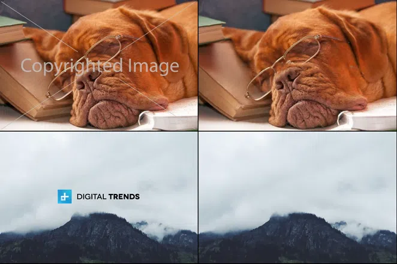
</div>

## ✅ Update 1

Updated the model architecture, and reduced the parameters count from ~3,000,000 to ~500,000 for faster inference.

## ✅ Update 2

Added api endpoint for easy usage:

```python

from api import remove_watermark

remove_watermark(
    image_path = IMAGE_NAME,
    mask_path = MASK_NAME,
    max_dim = MAX_DIM,
    show_step = SHOW_STEPS,
    reg_noise = REG_NOISE,
    input_depth = INPUT_DEPTH,
    lr = LR,
    training_steps = TRAINING_STEPS,
    tqdm_length = 900
)

```


## __This is the implementation of paper [Deep Image Prior](https://dmitryulyanov.github.io/deep_image_prior), all credit goes its authors.__

## My Contribution
- I provide a super simple yet highly effective solution to handle the scenario, which is not covered by the original paper, that is, when the watermark is not available separately to us prior to any training.
- A nice api wrapper which is easy to work with :)

## Introduction
CNNs are very common for image generation and restoration tasks. And it is believed that their great performance is because of their ability to learn realistic image priors from training on large datasets. This paper shows that the structure of a generator alone is sufficient to provide enough low-level image statistics without any learning. Thus most of the image restoration tasks, for example, denoising, super-resolution, artefacts removal, watermark removal etc can be done with highly realistic results without any training.

In this repo, I've implemented the watermark removal task, and the results are just as good as claimed by the authors. 

## When the watermark is available.

### # So in this scenario, the requirements are:

- The watermark that is applied to the watermarked image, is available to you.

- The scale, position, rotation and other spatial transformations of the watermark, exactly matches the applied watermark of the image.

Any watermarked image can be represented as the Hadamard product of `Original Image` and `Watermark`.

So if we know what `Watermark` is, then its just a matter of training a generator that produces outputs, such that `Watermarked Image` is equal to `Generated Image * Watermark`. And the authors propose to simply use L2 loss to minimize the distance between them. The generator simply takes the random noise with same height and width as of watermarked image, which we can regularize, and produces the outputs.

Here's a sample test run-

<table align="center">
 <tr>
  <th>Original Image</th><th>Watermark</th><th>Watermarked-Image</th>
 </tr>
 <tr>
  <td>
   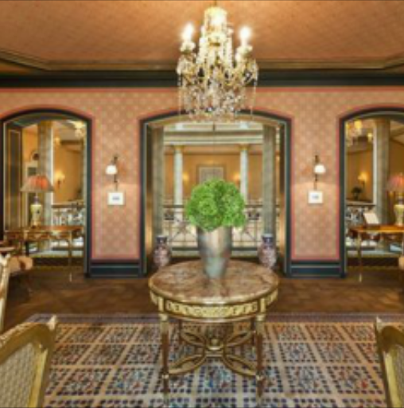
  </td>
  <td>
    
  </td>
  <td>
    
  </td>
</tr>
</table>

### # Running inference

Run `$ python inference.py` with following arguments-

```

Removing Watermark

optional arguments:
  -h, --help            show this help message and exit
  --image-path IMAGE_PATH
                        Path to the "watermarked" image.
  --mask-path MASK_PATH
                        Path to the "watermark" image.
  --input-depth INPUT_DEPTH
                        Max channel dimension of the noise input. Set it based
                        on gpu/device memory you have available.
  --lr LR               Learning rate.
  --training-steps TRAINING_STEPS
                        Number of training iterations.
  --show-step SHOW_STEP
                        Interval for visualizing results.
  --reg-noise REG_NOISE
                        Hyper-parameter for regularized noise input.
  --max-dim MAX_DIM     Max dimension of the final output image

```

### # Outputs

<div align="center">

</div>

## __When the watermark is not available__.

In this scenario, we'll have the watermarked image only. And this is the actual and highly realistic scenario because of obvious reasons. For very trivial causes, the first scenario was too easy to tackle than this one. Even the authors provided the outputs for the first scenario only.

### # Let us see how seriously difficult this is:

- Only the watermarked image is available.

- We can provide absolutely __no__ info to the generator regarding:

    - Where is the watermark?
    - What exactly is the part of watermark?
    - What exactly is not the part of watermark?

- And we want to do this without any training!!! Why? Well there's no point, I mean we know for a fact that the generator is indeed capable of inpainting the watermark, __it's just us who are not able to provide the answers to the generator for questions above.__

### # My solution

Read the last bold statement again, if we solve that issue, then it's just a matter of following the first scenario ain't it. I hope you can see where I'm going from this 😉. If you look at the bigger picture of watermark removal, then, in a nutshell, its just an image inpainting task right? So, all we need to do is, roughly highlight the watermarked region from any paint software and you're good to go.

Yup, it's just that simple.

Yes, it's not a holy new solution, I've seen it done before in form of image inpainting. But I never saw anyone applying this for removing the watermark.

Now you might be thinking that it's not a fully automated task anymore, since you would have to manually sit..tahh and highlight the watermarked region. Though I'm pretttty sure that after seeing the final results, you surely would enjoy that sitting :)

Moreover, think about how many problems we are solving by just simply doing this:

- No need to train a watermark detection model. It's hard to do than typical object detections.

- Even if we can detect the watermark, it still doesn't help that much, cuz the watermark can be drawn on the whole image, not on just a small region.

- No need to train the generator on huge image datasets for learning image statistics.

- No need to train the generator over an adversarial loss, which is already very difficult for producing higher resolution images like 1024 and more...

- And, all other solutions I've seen to far, which try to automate the whole procedure of detecting and removing the watermark, produces very visible artefacts.

Okay, enough talk.

The first step is to create an overlay containing strokes, that hides the watermark.

I'm simply using MS Paint for that. And per image, it hardly takes 1 minute to draw.

Here are some sample overlays...

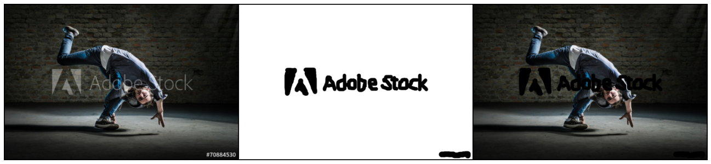

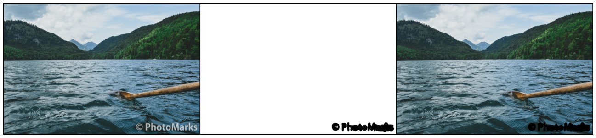


And the final step is to simply follow the above training procedure, by replacing the supposedly known watermark with our hand drawn overlay.

## # Time for the results

A sample progress of the generator:

<div align="center">

</div>

### Experiment 0

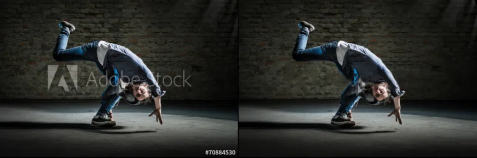

### Experiment 1


### Experiment 2


### Experiment 3


### Experiment 4


### Experiment 5

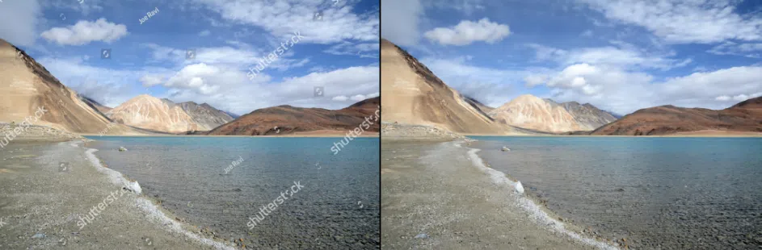

### Experiment 6

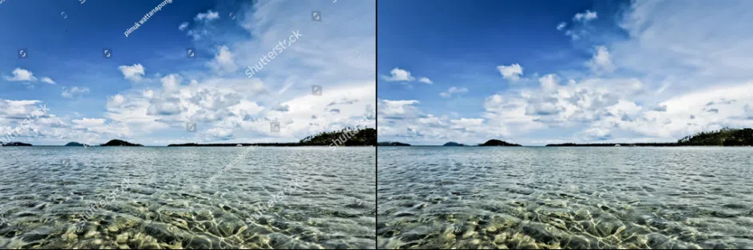

As I said earlier, the outputs are highly realistic with almost unnoticeable artefacts.

# A Bonus Usecase :)

Since watermark removal is one the application of image inpainting, so using this notebook you can even edit the images as per your need, that is removing any unwanted part of the image.

Below are the final outputs for some sample image editing examples:

<div align="center">
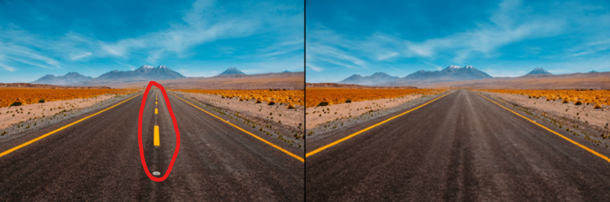
</div>

<div align="center">
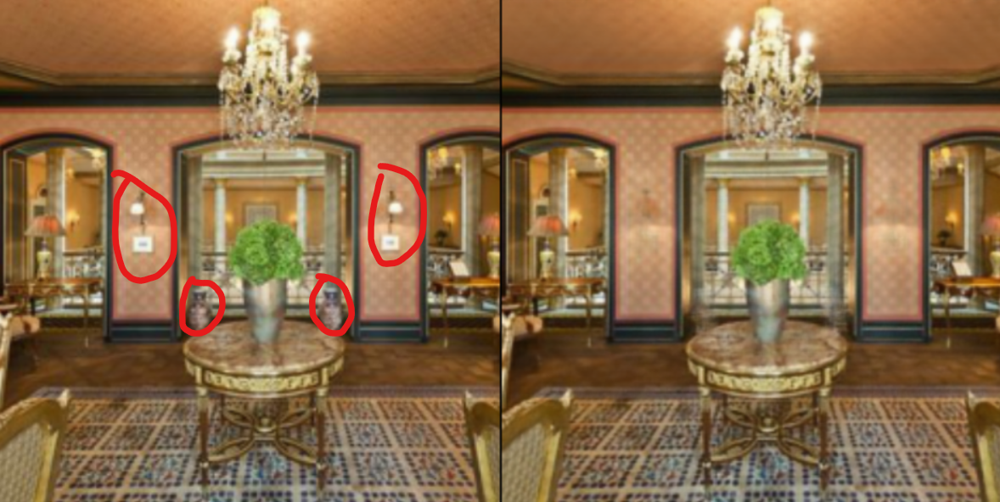
</div>

<div align="center">
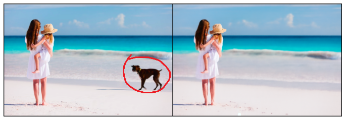
</div>

<div align="center">
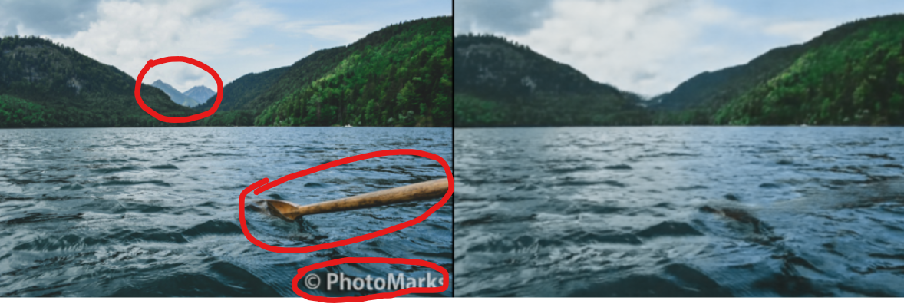
</div>

## # Note

Look at the last output image, as you can see, the final outputs contains pretty visible artefacts in this case. Our model is not trained on any dataset to learn any shape or form of image statistics, the outputs of the generator solely depends on the single image, multiplied by the mask, so if the mask is covering too much portion of the image, then it becomes too hard for the model to make the best predictions for filling those missing pixels. So in conclusion, thinner/detailed the mask, better the outputs. 

## [__Read Full Article__](https://brainbust.medium.com/watermark-removal-using-deep-image-priors-d37f87a9ca1)

# Author - Rishik Mourya [[Linkedin](https://www.linkedin.com/in/brain-bust/)]
