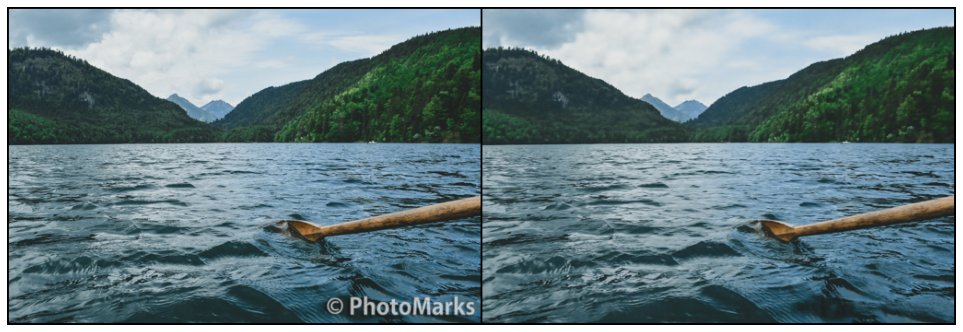
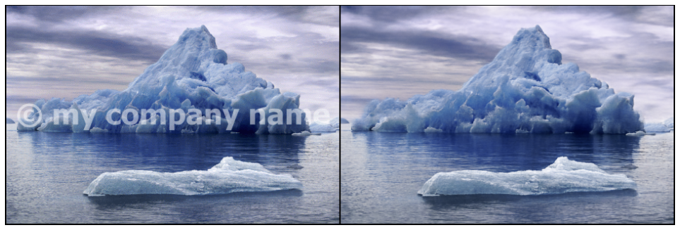
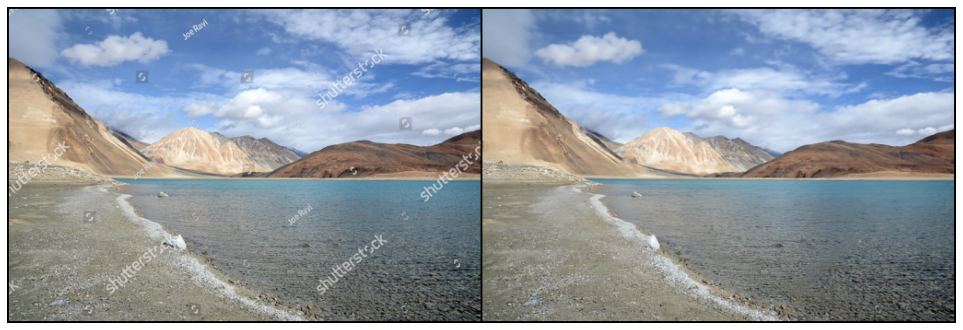
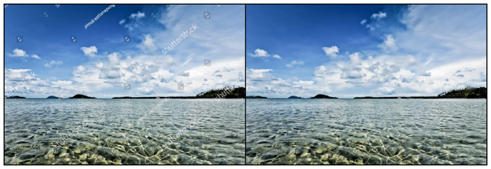

# Watermark Removal using Deep Image Priors with Pytorch

## __This is the implementation of paper [Deep Image Prior](https://dmitryulyanov.github.io/deep_image_prior), all credit goes its authors.__

CNNs are very common for image generation and restoration tasks. And it is believed that their great performance is because of their ability to learn realistic image priors from training on large datasets. This paper shows that the structure of a generator alone is sufficient to provide enough low-level image statistics without any learning. Thus most of the image restoration tasks, for example denoising, super resolution, artifacts removal, watermark removal etc can be done with highly realistic results without any training.

In this repo I've implemented watermark removal task, and the results are just as good as claimed by the authors. 

## When the watermark is available.

### # So in this scenario, the requirements are:

- The watermark that is applied to the watermarked image, is available to you.

- The scale, position, rotation and other spatial transformations of the watermark, extactly matches to the applied watermark of the image.

For example-

<table style="float:center">
 <tr>
  <th>Original Image</th><th>Watermark</th><th>Watermarked-Image</th>
 </tr>
 <tr>
  <td>
   
  </td>
  <td>
    
  </td>
  <td>
    
  </td>
</tr>
</table>

### # Running inference

Run `$ python inference.py` with following arguments-

```

Removing Watermark

optional arguments:
-h, --help          show this help message and exit
--image-path IMAGE_PATH
                    Path to the "watermarked" image.
--watermark-path WATERMARK_PATH
                    Path to the "watermark" image.
--input-depth INPUT_DEPTH
                    Max channel dimenstion of the noise input. Set it
                    based on gpu/device memory you have available.
--lr LR             Learning rate.
--training-steps TRAINING_STEPS
                    Number of training iterations.
--show-steps SHOW_STEPS
                    Interval for visualizing results.
--reg-noise REG_NOISE
                    Hyper-parameter for regularized noise input.
--device DEVICE
                    Device for pytorch, either "cpu" or "cuda".

```

### # Outputs


## __When the watermark is not available__.

In this scenario we'll have the watermaked image only. And this is the actual and highly realistic scenario because of obvious reasons. For very trivial causes, the first scenario was too easy to tackle than this one. Even the authors provided the outputs for first scenario only.

### # Let us see how seriously difficult this is:

- Only watermarked image is available.

- We can provide absolutely __no__ info to the generator regarding:

    - Where is the watermark?
    - What exactly is the part of watermark?
    - What exactly is not the part of watermark?

- And we want to do this without any training!!! Why? Well there's no point, I mean we know for a fact that the generator is indeed capable of inpainting the watermark, __its just us who are not able to provide the answers to the generator for questions above.__

### # My solution

Read the last bold statement again, if we solve that issue, then its just a matter of following first scenario ain't it. I hope you can see where I'm going from this 😉. If you look at bigger picture of watermark removal, then in a nutshell its just an image inpainting task right? So, all we need to do is, roughly highlight the watermarked region from any paint software and you're good to go.

Yup its just that simple.

Yes, its not a holy new solution, I've seen it done before in form of image inpainting. But I never saw anyone applying this for removing watermark.

Now you might be thinking that its not a fully automated task anymore, since you would have to manually sit..tahh and highlight the watermarked region. Though I'm pretttty sure that after seeing the final results, you surely would enjoy that sitting :)

Moreover, think about how many problems we are solving by just simply doing this:

- No need to train a watermark detection model. Its actually hard to do than typical object detections.

- Even if we are able to detect watermark, its still doesn't help that much, cuz the watermark can be drawn on whole image, not on just a small region.

- No need to train the generator on huge image datasets for learing image statistics.

- No need to train the generator over adversarial loss, which is already very difficult for producing higher resolution images like 1024 and more...

- And, all other solutions I've seen to far, which try to automate the whole procedure of detecting and removing watermark, produces very visible artificats.

Okay, enought talk.

First step is to create an overlay containing strokes, that hides the watermark.

I'm simply using MS Paint for that. And per image it hardly takes 1 minute to draw.

Here are some sample overlayes...


## # Time for the results

### Experiment 1



### Experiment 2


### Experiment 3



### Experiment 4


### Experiment 5



### Experiment 6



As I said earlier, the outputs are highly realistic with almost unnoticeable artifacts.